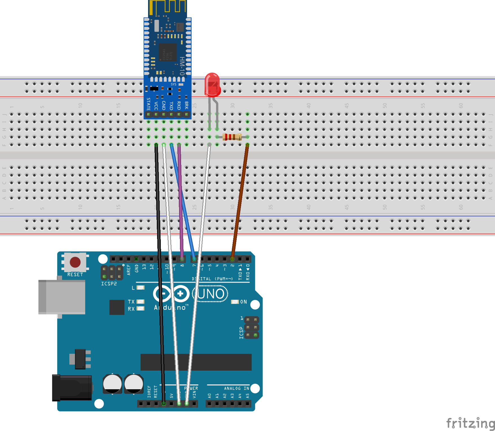

# [Blue Web](https://emlyon.github.io/blueweb/)

Web Bluetooth API and BLE devices

### References
- [BLE Scanner for Android](https://play.google.com/store/apps/details?id=com.macdom.ble.blescanner)
- [HM-10 Bluetooth 4 BLE Modules](http://www.martyncurrey.com/hm-10-bluetooth-4ble-modules/)
- [Control an Arduino via the HM-10 BLE module, from a mobile app on your smartphone](https://evothings.com/control-an-led-using-hm-10-ble-module-an-arduino-and-a-mobile-app/)
- [Web Bluetooth Terminal](https://github.com/1oginov/Web-Bluetooth-Terminal)
- [bluetooth-terminal](https://github.com/1oginov/bluetooth-terminal)
- [Web Bluetooth / Automatic Reconnect Sample](https://googlechrome.github.io/samples/web-bluetooth/automatic-reconnect.html)

### HM-10 Modules
[Module HM-10 Bluetooth 4.0 BLE low energy CC2540 CC2541 Serial Wireless Arduino](http://www.ebay.fr/itm/192117699011)
